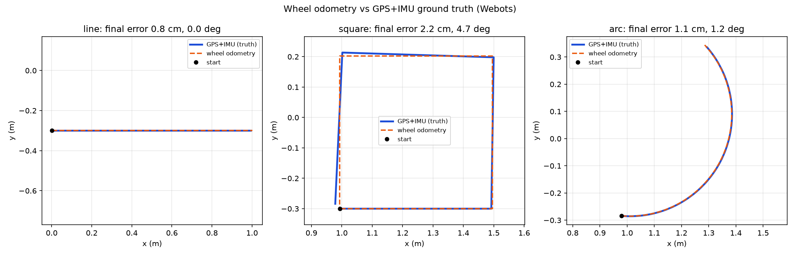

# Metrics summary (generated by tools/analyze_logs.py)

## Kinematics: commanded vs measured

| v_cmd (m/s) | w_cmd (rad/s) | wL, wR cmd (rad/s) | v_meas (m/s) | w_meas (rad/s) | v err % | w err % |
|---|---|---|---|---|---|---|
| +0.20 | +0.00 | +4.00, +4.00 | +0.1982 | +0.0000 | -0.90 | n/a |
| +0.00 | +1.00 | -2.40, +2.40 | -0.0000 | +0.9906 | n/a | -0.94 |
| +0.20 | +0.50 | +2.80, +5.20 | +0.1982 | +0.4953 | -0.90 | -0.94 |
| -0.10 | +0.00 | -2.00, -2.00 | -0.0991 | -0.0000 | +0.90 | n/a |

## Odometry vs GPS+IMU (drift)

| trajectory | distance driven (m) | final pos err (cm) | max pos err (cm) | final heading err (deg) |
|---|---|---|---|---|
| line | 0.99 | 0.83 | 1.08 | 0.00 |
| square | 1.99 | 2.15 | 2.38 | 4.72 |
| arc | 0.89 | 1.06 | 1.12 | 1.24 |

## Mission run

- rows logged: 1887
- mean cross-track error: 0.001 m
- max cross-track error: 0.063 m
- state sequence: FIND_PACKAGE -> NAVIGATE -> PICK -> PLAN_DELIVERY -> DELIVER -> DONE

Not covered here (measured by dedicated tools): LiDAR range accuracy (`plot_lidar.py`), detector rates (`eval_detector.py`), A* optimality (`plot_astar.py`).
