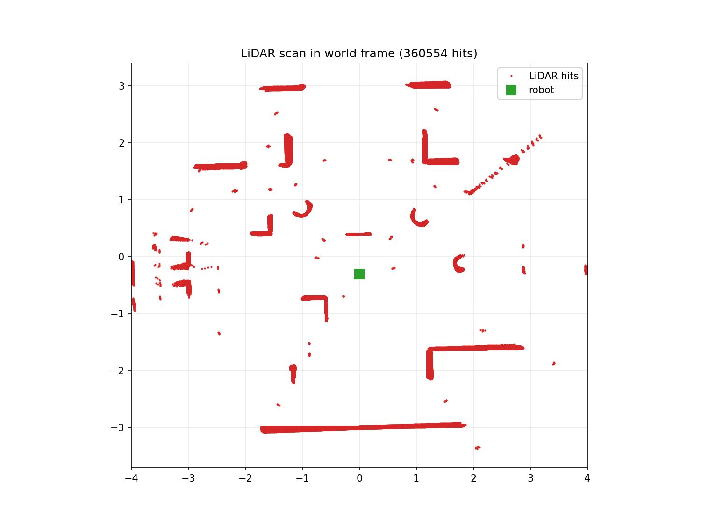
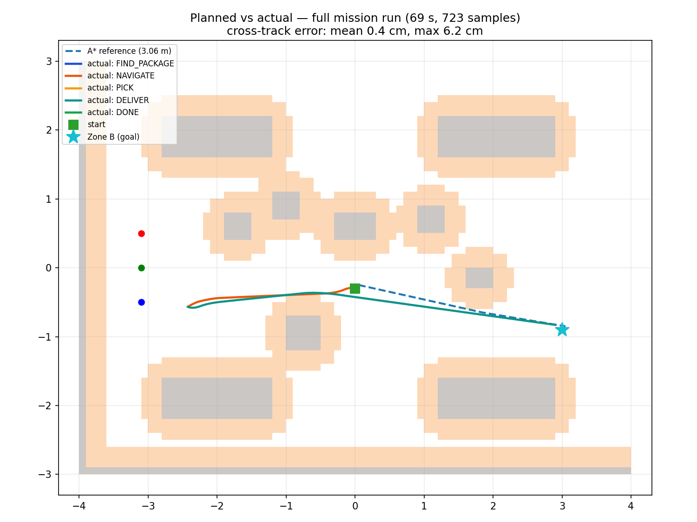

# Phase 6, 7, 8 and 9 — Explained in Simple Words

This file explains **what was built in Phases 6–8**, **why**, **what results
we measured in the real simulator**, and **how to run everything yourself**.
It is the companion of `Phase2_3_Explained.pdf` (Phases 0–5 concepts are not
repeated here). Read it top to bottom once before the evaluation.

---

## 1. Where we are in the story

Phases 2–3 built the world and taught the robot to drive in a straight line
and follow a known circle. Phase 6 is where all the pieces finally work
**together as one mission**:

> The robot **looks** for the blue package P3 with its camera, **plans** a
> route with A\*, **drives** there, **picks** it (a placeholder for now),
> **plans** a second route to Zone B, **delivers**, and prints a **mission
> report**. It decides all of this by itself — nothing is scripted.

Phase 7 collects the **proof** (numbers, plots, screenshots), Phase 8 makes
sure the **presentation** tells exactly that story, and Phase 9 is the
**to-do list for the final evaluation** (we deliberately did not build it
yet — see the last section).

---

## 2. Phase 6 — Planning ↔ control integration & the FSM

### 2.1 The state machine (FSM) in plain words

The robot's brain runs a **finite state machine** — a fixed list of states
with rules for moving between them. You can explain it with a flow chart:

| State | What the robot does | When it leaves |
|---|---|---|
| `IDLE` | Loads the task ("pick P3 → Zone B") | immediately |
| `FIND_PACKAGE` | Rotates in place; the camera looks for a big blue blob | 5 detections in a row → `NAVIGATE`; 2 full turns with nothing → `ERROR` |
| `NAVIGATE` | Chooses a **stand-off point** 0.45 m from the package (on the robot's side), plans A\*, drives there | reached → `PICK` |
| `PICK` | Stops 1 s, logs the distance. *Placeholder — the real grab comes in the final eval* | after the pause → `PLAN_DELIVERY` |
| `PLAN_DELIVERY` | Plans A\* from here to the centre of Zone B | path found → `DELIVER`; none → `ERROR` |
| `DELIVER` | Follows the waypoints to the zone | inside 0.15 m → `DONE` |
| `DONE` | Stops, prints the mission report | terminal |
| `ERROR` | Stops, prints the reason | terminal |

Every transition is printed to the console, e.g.
`[FSM] [t=25.3s] STATE: PICK -> PLAN_DELIVERY`. The same lines go into the
run log, so a grader can replay the whole mission from `logs/run.csv`.

**Why a state machine?** Because "find the package" needs different
behaviour than "drive precisely". The FSM is also trivial to test without
the simulator: the pytest suite drives it through the whole mission with a
fake planner and a pretend robot body.

### 2.2 What "planning glue" means (6.1)

`plan_to(start, goal)` is the one function everything uses. It does four
steps: snap the points onto the grid → run A\* on the **inflated** map →
shorten the path with line-of-sight checks → resample it every 0.3 m. The
console prints one line per plan:

```
[FSM] A* path: 21 waypoints, 5.54 m, 11.6 ms, 1675 expansions
```

That single line is the answer to "is A\* working?" — it shows the path
length, the computation time (milliseconds) and how many grid cells the
search explored.

### 2.3 The in-sim dashboard and the status LED (6.10, 6.11)

The robot carries a small **Display** like a screen on top. At 2 Hz it
draws: the known map (grey = obstacle, orange = safety inflation), the
current planned route (orange dots + lines), the robot (blue dot with a
heading tick) and the current FSM state as text. There is also an **LED**
whose colour mirrors the state (blue = searching, orange = picking, green =
done, red = error). Both are pure extras — if they break, the mission still
works.

### 2.4 Repeatability mode (6.8)

One run proves little. `config.CAMPAIGN_STARTS` stores 10 different start
poses. Running

```
RUN_INDEX=3  webots worlds/warehouse.wbt
```

teleports the robot to start pose number 3 **before** the mission and logs
to `logs/run_3.csv`. After 10 runs, `python tools/analyze_logs.py` writes
`docs/evidence/runs_summary.md` with the success rate, mission time and
final goal error per run.

---

## 3. Phase 7 — Evidence, metrics, documentation

### 3.1 The evidence chain

Every claim in the report must point at a file. The chain is:

```
run in Webots  →  logs/*.csv  →  tools/*.py  →  docs/evidence/*  →  slides
```

`python tools/check_evidence.py` prints an inventory of all expected
artefacts with P0/P1 status (written to `docs/evidence/inventory.md`). At
the time of writing exactly **one** P0 item is still open: the ≤60 s screen
recording (`run_full.mp4`) — everything else exists.

### 3.2 The metrics that matter (measured 2026-10-07)

| Metric | Value | Evidence file |
|---|---|---|
| Full mission | FIND → NAVIGATE → PICK → DELIVER → **DONE** in **69.2 s**, 8.2 m driven, replans 0 | `logs/run.csv`, `metrics.md` |
| Package position estimate | (−2.99, −0.57) vs true (−3.10, −0.50) → **0.13 m error** | console + `position_estimate.md` |
| Cross-track error while following | mean 0.4 cm, max **6.2 cm** | `metrics.md` |
| LiDAR ray order | **index increases clockwise** (SIGN = −1, offset 0.02 rad) | `lidar_validation.md` |
| LiDAR range accuracy | median \|measured − expected\| **8 cm** over the whole arena | `lidar_validation.md` |
| Final goal error | robot stopped (2.90, −0.83) vs Zone B (3.0, −0.9) → **0.12 m** | `run.csv` last row |
| A\* optimality | cost == Dijkstra on 60 random grids | pytest |
| Unit tests | 63/63 green | pytest |

**The LiDAR story is worth telling in the viva.** The first mission runs
estimated the package 0.6 m short of its true position. Diagnosis: we
assumed LiDAR ray 0 points to the robot's right and indices go
counter-clockwise. To check it we logged **1321 raw scans while the robot
rotated one full turn** (`DRIVE_TEST_MODE=lidar`), then compared every ray
against the known map offline (`tools/calibrate_lidar.py`). The best-fitting
convention is the **mirror image** of our assumption. After setting
`LIDAR_ANGLE_SIGN = -1` in `config.py`, the estimate error dropped from
0.6 m to **0.13 m**. Lesson: never trust an axis convention you have not
measured.



### 3.3 Planned vs actual (the money plot)

`tools/plot_run.py` re-plans the A\* route from the logged run and overlays
the **actual** trajectory, coloured by FSM state. The DELIVER leg hugs the
planned line — that is PID heading control doing its job. The figure below
is regenerated automatically by `tools/analyze_logs.py` after every run.



### 3.4 The documents (7.3–7.7)

| File | What a grader finds there |
|---|---|
| `docs/architecture.md` | Block diagram + one plain-language paragraph per module + A/B/C ownership |
| `README.md` | Install, run, test, campaign and evidence commands |
| `docs/qa_prep.md` | 29 likely viva questions with short answers |
| `docs/demo_script.md` | 5-minute demo flow, recording steps, per-slide presenter table |
| `docs/project_report.md` | Report skeleton with the real numbers already filled in |

---

## 4. Phase 8 — the deck and the rehearsal

The deck `IntelliBot_MidTerm_Review.pptx` (10 slides, built with
`tools/build_deck.js`) was updated to match the measured reality:

- slide 8 now has a green column **"Measured on the robot"** (kinematics
  error ≤ 1 %, odometry drift 2.2 cm/4.7°, the 69 s mission, detector 100 %
  on real frames) and an orange column **"still to measure"**;
- the challenges listed are the ones we actually hit (see §5);
- `docs/demo_script.md` assigns every slide a primary presenter (A/B/C)
  with a backup, plus the exact steps to record the fallback video
  (Webots: *Tools → Movie → Record Movie*).

Rehearsal rule: **every number said aloud must exist in `docs/evidence/`** —
if you cannot point at the file, do not say the number.

---

## 5. Problems we hit and fixed (great viva stories)

1. **"The robot does not move at all."** The Webots console said
   `The controller directory has not been found … Starting the <generic>
   controller instead`. Cause: the `controllers/intellibot_controller/` and
   `controllers/drive_test/` folders were missing (deleted together with
   uncommitted work). Fix: restore from git. Lesson: the `<name>/<name>.py`
   folder next to `worlds/` **is** the controller — without it Webots plugs
   in an empty generic brain.
2. **The robot picked the wrong "package".** After adding a small
   decorative ball, FIND_PACKAGE happily "found P3" next to it: the ball was
   painted saturated blue — exactly the package colour the HSV detector
   looks for. Fix: desaturate the ball to grey. Lesson: the environment and
   the detector share colour semantics; colours are an interface.
3. **Package estimate 0.6 m short** — the mirrored LiDAR ray order, see
   §3.2.
4. **The run log kept growing after DONE** — `simulationQuit` did not
   terminate batch runs reliably, so the controller now breaks its own loop
   2 s after DONE/ERROR and writes one final CSV row with the terminal
   state.
5. **Sphere physics warning** — Webots limits `Sphere.subdivision` to 5;
   we had 12. Fix: subdivision 4 (plenty for a 15 cm ball).

---

## 6. How to run everything (cheat sheet)

```bash
# 0) tests first (no Webots needed)
python -m pytest tests/ -q                        # 63 passed

# 1) regenerate both worlds from config
python tools/generate_world.py                    # writes worlds/ + worlds_output/

# 2) the mission demo (GUI): press the play button
webots worlds/warehouse.wbt
#    console shows [FSM] transitions, A* lines, MISSION REPORT

# 3) validation runs (CLI, fast)
DRIVE_TEST_MODE=worldcheck  webots --batch --mode=fast --stdout --stderr --minimize worlds/warehouse_drive_test.wbt
DRIVE_TEST_MODE=lidar       webots --batch --mode=fast --stdout --stderr --minimize worlds/warehouse_drive_test.wbt
python tools/calibrate_lidar.py                   # ray order + accuracy + lidar_scan.png

# 4) analysis + evidence
python tools/analyze_logs.py                      # metrics.md, odometry overlay, planned_vs_actual
python tools/check_evidence.py                    # what evidence exists / is missing

# 5) repeatability campaign (Phase 6.8)
RUN_INDEX=0 webots worlds/warehouse.wbt           # ... up to RUN_INDEX=9
python tools/analyze_logs.py                      # -> runs_summary.md
```

The **recording** for the final P0 item: start the mission in the GUI,
*Tools → Movie → Record Movie*, stop after `MISSION REPORT`, save as
`docs/evidence/run_full.mp4`.

---

## 7. Phase 9 — what is deliberately left for the final evaluation

| Item | The hook that already exists |
|---|---|
| Dynamic obstacle appears mid-route → robot re-plans | `add_obstacle_world`, `path_is_blocked`, follower `BLOCKED` status — all unit-tested |
| Real pickup (attach & carry) | supervisor access + `Connector { autoLock }` recipe in the samples audit |
| Collision counter | bumper sample (`TouchSensor`), mission report already prints the field |
| Detector robustness (lighting, distances) | capture mode + `eval_detector.py` pipeline ready |
| In-sim dashboard upgrade, second robot, Dijkstra/RRT comparison | `display_supervisor` / `emitter_receiver` samples audited |

The rule we followed: **build the hook now, build the feature later** —
every final-eval item plugs into something that is already tested.
